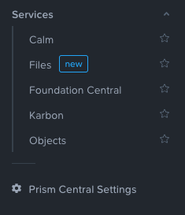
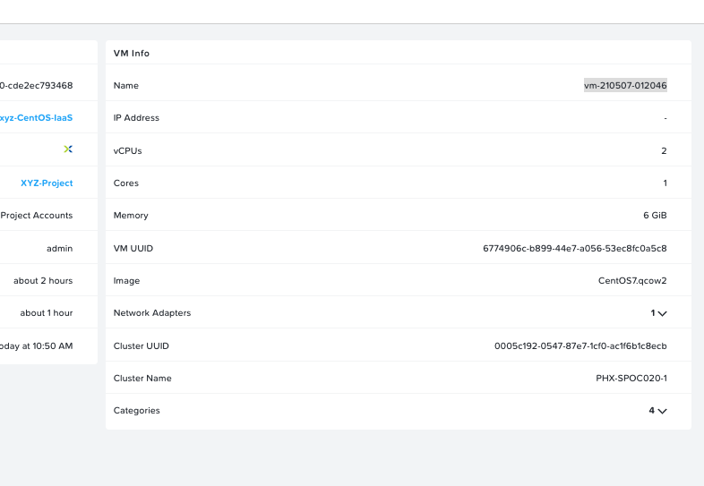
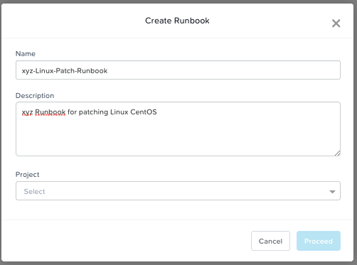
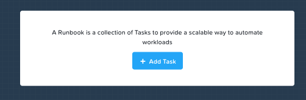
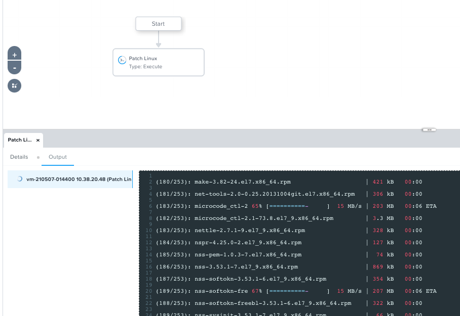
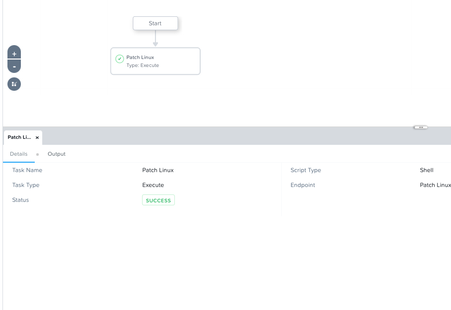

.. _calm_runbook_linux:

---------------------------------
Calm: Linux Patching Runbook
---------------------------------

*The estimated time to complete this lab is 20 minutes.*

Overview
++++++++
In this lab you will be creating a Linux Runbooks for patching your deployed Linux VM via the earlier modules.

Get the needed information
++++++++++++++++++++++++++

#. In **Prism Central**, select :fa:`bars` **> Services > Calm**

#. Click |applications| and click on your *Initials*-CentOS-IaaS-2 application

#. In the *Overview* page, under *VM Info*, copy the **Name** of the VM that has been deployed earlier by the Blueprint.

    VM Name in Applications -> Overview

Creating a Linux Runbook
++++++++++++++++++++++++

#. Click the |runbooks| icon

#. If you are the first person to create a Runbook, you will see the **No Runbooks added** screen. Click the **Create your first Runbook** button.

#. In the **Create Runbook** provide the following:

   - **Name** - *Initials*-Linux-Patch-Runbook
   - **Description** - xyz Runbook for patching Linux CentOS
   - **Project** - *Initials*-Project
   - Leave the rest default

    Create a Runbook

#. Click **Proceed**

#. Click in the new screen that opens **+ Add Task**

    Add Task to runbook

#. Provide the following to the required fields

   - **Task name** - Patch Linux VM
   - **Type** - Execute
   - **Script Type** - Shell
   - **Endpoint** - Add New Endpoint

     - **Name** - Patch Linux VM <NAME OF YOUR DEPLOYED VM>
     - **Description** - Optional
     - **Type** - Linux
     - **Target Type** - VM
     - **Account** - NTNX_LOCAL_AZ
     - **VM** - select your VM. You can use *Filter By* to find your VM easier

       - **Select Attribute** - Name
       - **Select Operator** - Equals
       - **Enter Value** - Your VM Name
       - Click the **Add** button
       - Select your VM from the list

     - **Credential** - root
     - **Secret Type** - Password
     - **Password** - nutanix/4u
     - Click **Save**

   - **Credentials** - Add New Credentials

     - **Credential Name** - root
     - **Username** - root
     - **Secret Type** - Password
     - **Password** - nutanix/4u
     - Click **Done**

   - **Script** - Copy the following

     .. code-block:: bash

        #!/bin/bash
        yum -y update
        yum -y upgrade

   .. figure:: images/3.png
        :align: center

        Create task

#. Click the **Save** button in the top right corner

#. Click the **Execute** button

#. Select your Endpoint that you created earlier

#. Click the **Execute** button

#. This will open the Runbook interface. Check the progress of the task by clicking the **Output** tab at the bottom of the page

    Running task

#. Wait untill the task has the **SUCCESS** status before progressing to the next module.

    Successfully run task

Takeaways
+++++++++

What are the key things you should know about **Runbooks**?

- Runbooks provides possibilities to run tasks against multiple machines (endpoints). These task can be single or multiple stpes, depending on the needs.

- As Runbooks are not pone to Human error as they run automated, all changes are the same for all targetted endpoints and provide consistency.

- Common day 2 operations, like snapshotting, restoring, cloning, and updating the infrastructure can all be done by end users directly within Calm.

.. |proj-icon| image:: ../images/projects_icon.png
.. |mktmgr-icon| image:: ../images/marketplacemanager_icon.png
.. |mkt-icon| image:: ../images/marketplace_icon.png
.. |bp-icon| image:: ../images/blueprints_icon.png
.. |blueprints| image:: ../images/blueprints.png
.. |applications| image:: ../images/blueprints.png
.. |projects| image:: ../images/projects.png
