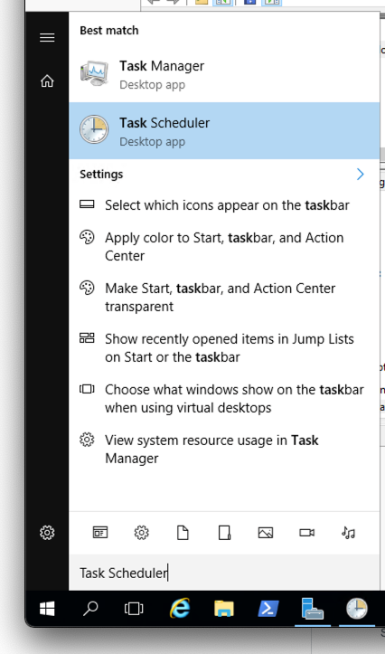
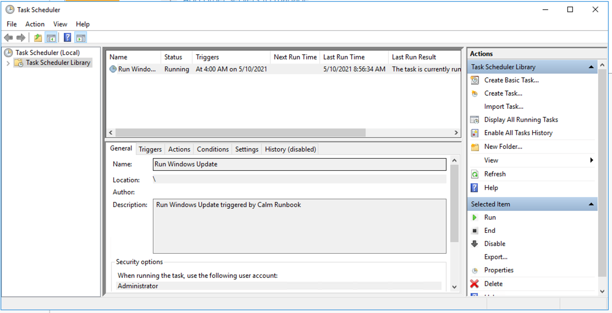

.. _calm_runbook_windows:

---------------------------------
Calm: Windows Patching Runbook
---------------------------------

*The estimated time to complete this lab is 20 minutes.*

Overview
++++++++

In this lab, we will create a Calm Runbook for Windows Patching.

*The estimated time to complete this lab is 20 minutes.*

Overview
++++++++
In this lab you will be creating a Linux Runbooks for patching your deployed Linux VM via the earlier modules.

Get the needed information
++++++++++++++++++++++++++

#. In **Prism Central**, select :fa:`bars` **> Services > Calm**

   .. figure:: images/1_access_calm.png
       :align: center

#. Click |applications| and click on your *Initials*-Win-IaaS-2 application

#. In the *Overview* page, under *VM Info*, copy the **Name** of the VM that has been deployed earlier by the Blueprint.

   .. figure:: images/0.png
       :align: center
       :alt: VM Name in Applications -> Overview

Creating a Windows Runbook
++++++++++++++++++++++++++

#. Click the |runbooks| icon

#. If you are the first person to create a Runbook, you will see the **No Runbooks added** screen. Click the **Create your first Runbook** button.

#. In the **Create Runbook** provide the following:

   - **Name** - *Initials*-Windows-Patch-Runbook
   - **Description** - xyz Runbook for patching Windows
   - **Project** - *Initials*-Project
   - Leave the rest default

   .. figure:: images/1.png
       :align: center
       :alt: Create a Runbook

#. Click **Proceed**

#. Click in the new screen that opens **+ Add Task**

   .. figure:: images/2.png
       :align: center
       :alt: Add Task to runbook

#. Provide the following to the required fields

   - **Task name** - Patch Windows VM
   - **Type** - Execute
   - **Script Type** - Powershell
   - **Endpoint** - Add New Endpoint

     - **Name** - Patch Windows VM <NAME OF YOUR DEPLOYED VM>
     - **Description** - Optional
     - **Type** - Windows
     - **Target Type** - VM
     - **Account** - NTNX_LOCAL_AZ
     - **VM** - select your VM. You can use *Filter By* to find your VM easier

       - **Select Attribute** - Name
       - **Select Operator** - Equals
       - **Enter Value** - Your VM Name
       - Click the **Add** button
       - Select your VM from the list

     - **Credential** - Administrator
     - **Secret Type** - Password
     - **Password** - Nutanix/4u
     - Click **Save**

   - **Credentials** - Add New Credentials

     - **Credential Name** - Administrator
     - **Username** - Administrator
     - **Secret Type** - Password
     - **Password** - Nutanix/4u
     - Click **Done**

   - **Script** - Copy the following

     .. code-block:: powershell

        Enable-WSManCredSSP -Role Server -Force
        [Net.ServicePointManager]::SecurityProtocol = [Net.SecurityProtocolType]::Tls12
        Install-PackageProvider -Name NuGet -MinimumVersion "2.8.5.208" -Force
        Install-Module PSWindowsUpdate -Force
        Get-WUList
        
        # Due to limitation/security we need to run the execution via a scheduled task (https://community.spiceworks.com/topic/954498-windows-update-module-for-powershell-access-denied-on-remote-pc-in-workgroup)
        # Let's deploy one small update
        $taskAction = New-ScheduledTaskAction -Execute 'powershell.exe' -Argument 'Get-WindowsUpdate -KBArticleID KB5001402 -Install -Confirm:$false'
        $taskTrigger = New-ScheduledTasktrigger -Once -At 4am
        $taskUser = 'Administrator'
        $taskPasswd = 'Nutanix/4u'
        $taskName = 'Run Windows Update'
        $description = 'Run Windows Update triggered by Calm Runbook'
        $taskSettings = New-ScheduledTaskSettingsSet -StartWhenAvailable -RunOnlyIfNetworkAvailable -DontStopOnIdleEnd
        Register-ScheduledTask -TaskName $taskName -Action $taskAction -Trigger $taskTrigger -Description $description -RunLevel Highest -User $taskUser -Password $taskPasswd -Settings $taskSettings 
            
        # Is the task registered?
        Get-ScheduledTaskInfo -TaskName "Run Windows Update"
        
        # Start the task
        Start-ScheduledTask -TaskName "Run Windows Update" -AsJob
        

   .. figure:: images/3.png
        :align: center
        :alt: Create task

#. Click the **Save** button in the top right corner

#. Click the **Execute** button

#. Select your Endpoint that you created earlier

#. Click the **Execute** button

#. This will open the Runbook interface. Check the progress of the task by clicking the **Output** tab at the bottom of the page

   .. figure:: images/4.png
       :align: center
       :alt: Running task

#. Wait untill the task has the **SUCCESS** status before progressing to the next module.

   .. figure:: images/5.png
       :align: center
       :alt: Successfully run task

#. Open a RDP sesison to your Windows 2016 VM

#. Open the **Task Scheduler** by Clicking the windows "Start" button and type **Task**

#. Your task should be mentioned, the **Last Run Time** columsn should hsow time and date of just a few minutes old, and the **Last Run Result** column should mention *The task is currently running*

Takeaways
+++++++++

What are the key things you should know about **Runbooks**?

- Runbooks provides possibilities to run tasks against multiple machines (endpoints). These task can be single or multiple stpes, depending on the needs.

- As Runbooks are not pone to Human error as they run automated, all changes are the same for all targetted endpoints and provide consistency.

- Common day 2 operations, like snapshotting, restoring, cloning, and updating the infrastructure can all be done by end users directly within Calm.

.. |proj-icon| image:: ../images/projects_icon.png
.. |mktmgr-icon| image:: ../images/marketplacemanager_icon.png
.. |mkt-icon| image:: ../images/marketplace_icon.png
.. |bp-icon| image:: ../images/blueprints_icon.png
.. |blueprints| image:: ../images/blueprints.png
.. |applications| image:: ../images/blueprints.png
.. |projects| image:: ../images/projects.png
.. |runbooks| image:: ../images/runbooks.png